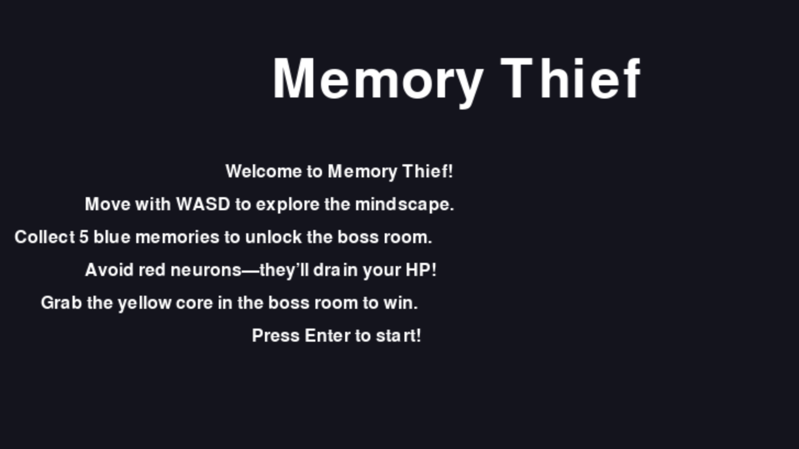
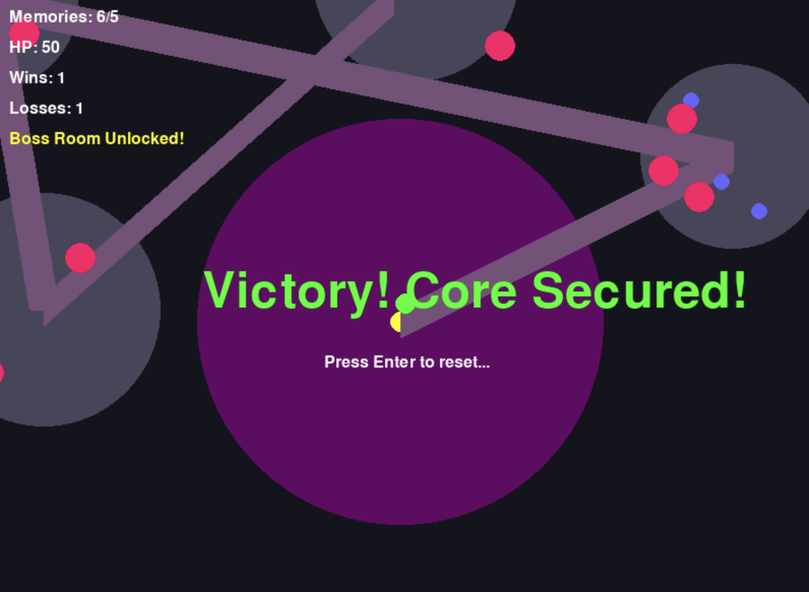
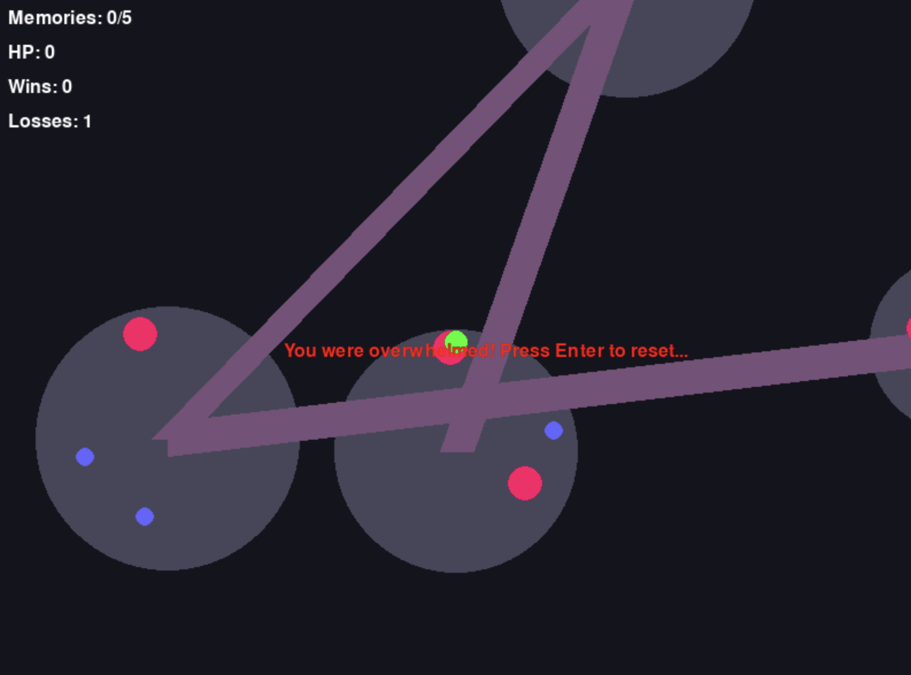

# Memory Thief

A top-down 2D roguelite built with Python and Pygame. Infiltrate procedurally generated "mind dungeons" as a spectral thief, stealing memories to gain temporary abilities while managing corruption. Navigate a brain-like labyrinth, defeat the Core Neuron, and escape with the Core Memory before the mind collapses.

## Features

- **Procedural Dungeons**: Randomized rooms and corridors mimicking a neural network.
- **Memory Mechanics**: Absorb enemy memories for buffs (e.g., speed, invisibility) that fade over time, with a corruption trade-off.
- **Roguelite Progression**: Permadeath with permanent upgrades via memory fragments.
- **Code-Driven**: Built entirely programmatically—no mouse, all keyboard control.

## Status

- [x] Basic player movement (WASD)
- [x] Procedural dungeon generation (rooms + corridors)
- [x] Collision with dungeon walls
- [x] Neuron enemies with memory drops
- [x] Memory absorption and corruption system
- [x] Core Memory boss and exit
- [ ] Any More Ideas?

## Screenshots

### Intro Screen
Start your journey with the rules laid out.


### Victory
Secure the core and claim your win!


### Game Over
Too many hits? Time to try again.


## Getting Started

1. **Prerequisites**: Python 3.7+ and Git.
2. **Clone the Repo**:
   ```bash
   git clone https://github.com/mwilcome/memory-thief.git
   cd memory-thief
   ```
3. **Set Up Virtual Environment**:
   ```bash
   python3 -m venv venv
   source venv/bin/activate
   pip install pygame
   ```
4. **Run**:
   ```bash
   python main.py
   ```

## Controls

- **WASD**: Move the player
- **Quit**: Close the window

## Credits

- **Developed by**: [Mike Wilcome/@mwilcome]
- **AI Assistance**: Grok 3 (built by xAI) - Huge thanks for the coding guidance, architecture ideas, and keeping this project rolling!